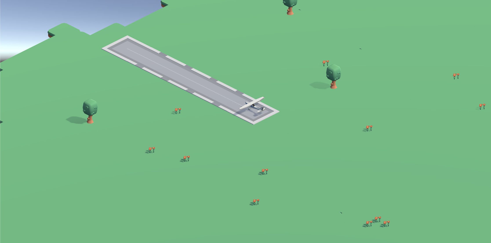

# Fly Around!

A low-poly isometric flying game you can play in the browser. Take off, cruise over a peaceful landscape of trees and flowers, and (try to) land the plane.



> This is still a very, very early prototype, so expect some rough edges.

## How to play

| Key | Action |
| --- | --- |
| `T` | Take off (when on the ground) |
| `←` / `→` | Steer the plane |
| `L` | Land in whatever direction you're facing (when in the air) |
| `G` | Autoland (when in the air — still very experimental) |

Refresh the browser to restart.

## Tech

- Built with **Unity 2022.3.32f1** and exported as a WebGL build (`Build/` contains the compiled loader, framework, WASM, and data files).
- `index.html` and `TemplateData/` provide the web shell, loading bar, and on-page instructions.
- Hosted on **Netlify** — `Netlify.toml` sets the `Content-Encoding`/`Content-Type` headers needed to serve the Brotli-compressed Unity build files.

## Deploying

The Unity project exports its WebGL build to `~/Desktop/plane`. Running the deploy script syncs that build into this repo (preserving the customized `index.html` and `TemplateData/style.css`), commits, and pushes to `main`, which triggers a Netlify deploy:

```sh
./deploy.sh
```
